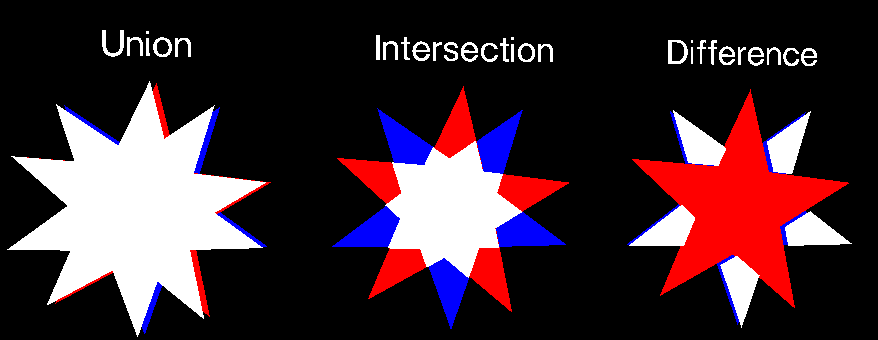

# clipper2-ts
Example of using [clipper2-js](https://github.com/IRobot1/clipper2-ts/tree/master/projects/clipper2-js) Union, Intersection and Difference clipping operations.  
Shapes are rendered and animated using threejs

[Codesandbox demo](https://codesandbox.io/s/three-clipper-example-fg4lp9)



### Documentation

[Clipper2 HTML documentation](http://www.angusj.com/clipper2/Docs/Overview.htm)

### Example

```ts
const subj = new Paths64();
const clip = new Paths64();
subj.push(Clipper.makePath([ 100, 50, 10, 79, 65, 2, 65, 98, 10, 21 ]));
clip.push(Clipper.makePath([98, 63, 4, 68, 77, 8, 52, 100, 19, 12]));
const solution = Clipper.Intersect(subj, clip, FillRule.NonZero);
```
